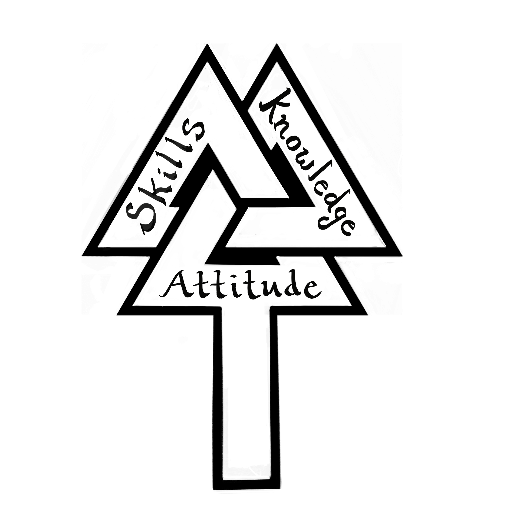

# High School Graduation and
# College & Career Readiness Act of 2016 

**menu**

 - [People](people.md): Students, Parents, Teacher, Advisors
 - [About](about.md): Analysis of Need, Current Efforts, Demographics
 - [Courses](courses.md): Descriptions and Schedule
 - [Logistics](logistics.md): Homework, Grades, Rules
 - [Outcomes](outcomes.md): Habits of Mind, Projections, Proficiencies
 - [Timeline](timeline.md): Blog of progress with visuals!

### The goals of Oregon's Measure 98 is to "support the needs of students related to engagement, personalization, achievement, and college and career readiness."  

More than a drop-out prevention program, the MAKERTEENS school within a school Career Academy model offers students college credit and career readiness skills as they complete a well rounded curriculum and build a Tiny House in one school year.

* * *

**Proposal**  
Provide a dozen at-risk high school students the opportunity to build a tiny house on a trailer frame. This same MAKERTEENS cadre will be mentored through the following classes: Family and Consumer Science, AP Studio Art, AP Psychology, Web Design, Band, Integrated Science, Language Arts, Health/PE, Construction Math. This well-rounded, project-based, intense mentorship, along with job shadowing in the community, and parent engagement, will effectively move a student toward a diploma, personal success, and job skills. Additionally, students may earn badges and certificates in industry recognized proficiencies.

**Funding**  
Measure 98 provides $800 ($400 as of May 2017) per high school student allocation based on the school district’s Average Daily Membership weighted (ADMw) formula, similar to the State School Fund. After July 1, 2017, districts are invited to submit their biennial plan for raising high school graduation rates through career and technical education programs with college-level educational opportunities (~[source]~(http://www.oregon.gov/ode/learning-options/CTE/statefund/Documents/m98_ip65_text.pdf))

* * *

**Rational for self-contained “school within a school” program**  
Evidence suggests smaller learning communities can boost student achievement, improve attendance rates, decrease disciplinary referrals, and raise self-esteem. (Kemple, 2006)

In the typical 40 hour week workplace, a supervisor manages a group of workers, all day, all week. There is no “falling through the cracks” as one worker shuffles between 5 or more supervisors during a work day like in a large high school. A quietly sullen student could go undetected the full day, a passive-aggressive student could balance a shoulder chip for 50 minutes as the teacher avoided conflict. A class clown could deflect responsibility or feign incompetence for a short disruptive period, with all actors relieved knowing that the gig will soon be up. These practiced behaviors function to evade work. Students at-risk hide in fear of being rejected, covertly pleading to be known and respected an adult. A full day with the same teacher greatly diminishes student ability to smoke screen fears and weaknesses. Although initially painful and time consuming, the results are worth the effort. Under continuous, intensive, relentless care, pretenses fall away, authenticity surfaces, and the whole person can be rehabilitated, in the truest sense of forming beneficial habits.

Additionally, viable cross-curricular project-based learning is more feasible and coherent when delivered by the same individual who strategically integrates learning opportunities within the dynamic flow of group and individual needs. This relevant education, within a positive environment aimed to meet individual needs, will diminish the frequency of students who feel alienated and disengaged from school. A smaller learning community strengthens relationships.

This alternative school provides the IEP team with another possible least restrictive environment (LRE) in their continuum of placement options.

The alternative education teacher is not a lone ranger but is seen as a team member who collaborates by blending RTI (Response to Intervention) and individual PBIS student supports and interventions for students with significant behavioral needs in the wraparound planning process.

* * *

**Potential Barriers**:  
A self-contained alternative education program within a traditional school has the intrinsic danger of stigma. Additionally, the risk factors from inappropriate peer associations may be compounded. Disengagement with “normal” school activities can accelerate the tendency to drop out of school. A concentration of impulsive youth with negative attitudes can feed on each other in an escalation of poor behaviors and general rebelliousness. For the uninitiated, being regularly exposed to delinquency may be a gateway to illicit substance abuse, pornography, foul language, and a host of other behaviors in a type of prison yard training ground.  
However, teacher awareness of such potential to downward spiral, empowers the teacher to nip problems in the bud, redirect negative energy, maintain firm expectations and supports for success, and immediately trouble shoot the function of counter-productive behaviors by collaborating with parents, colleagues, and students as appropriate.

MAKERTEENS delineate entrepreneurial plans as employers, prepare resumes as employees, and practice for college admission interviews in order to effectively thrive in any potential contingency. Above-all, MAKERTEENS are trained to grade themselves along their quest to package their lives as a gift to their current and future friends, family, and community. In the process of life, grades on extrinsic behaviors cannot accurately approximate the true value of intrinsic habits of mind.

* * *   

Over the course of 36 weeks, approximately 360 hours are set aside for building the Tiny House. If 10 students fully participated every available hour, then 3,600 hours would be expended toward project completion. (One highly skilled journeyman could build the same in about 200 hours.) The excess class time includes training in tool safety, job site safety, practice projects, house design and research, drafting in Sketch-up, learning regulations, and best practices of specialty trades, dealing with the permit process, and taking time for teachable moments related to art, math, science, and psychology. Additionally, the videography team sets up shots and lighting for quality documentation.

* * *

**Criteria for Approval of Biennial Plan**  

*   (1) School districts and charter schools must prepare a biennial plan that addresses proposed spending of High School Graduation and College and Career Readiness Fund monies. School districts and charter schools may collaborate and submit one plan on behalf of multiple participants. ESDs may prepare a biennial plan on behalf of a consortium of school districts and charter schools.
*   (2) The biennial plan must
*   (a) Comply with the requirements of section 1, chapter 1, Oregon Laws 2017and rules adopted to implement section 1, chapter 1, Oregon Laws 2017;
*   (b) Cover a minimum of two years but may be longer;
*   (c) Address current data and analysis of contributing causes;
*   (d) Prioritize spending on programs that serve those students identified by the school district as most at-risk of not graduating or being college or career ready, historically and traditionally marginalized and historically underrepresented;
*   (e) Include plans to establish or expand upon current efforts by the school district or charter school with evidence-based practices in three areas:
*   (A) CTE programs in high schools;
*   (B) Access to college-level educational opportunities for students in high schools; and
*   (C) Drop-out prevention strategies in all high schools;
*   (f) Demonstrate coordination between the three areas of spending;
*   (g) Identify resources and specific strategies for historically and traditionally marginalized students and historically underrepresented students and demonstrate what will be accomplished;
*   (h) Identify supports for teachers, counselors, and administrators to implement specific strategies; and
*   (i) Identify projections for disaggregated targets related to graduation, student participation in CTE and dual credit, advanced placement, International Baccalaureate, or comparable college-level courses, improvements in attendance, and student progress towards career pathways.
*   (3) The deadline for biennial plan submission is July 1 of the first year of each biennium.
*   (4) The Oregon Department of Education must review biennial plans submitted by each district to determine whether the plan should be approved. Plans will be approved if they meet the requirements of (2) of this rule.

For clarification, contact CTE Specialist Reynold.Gardner@ode.state.or.us at 503-947-5615.

The U.S. Department of Education defines an alternative education school as ”a public elementary/secondary school that addresses the needs of students which typically cannot be met in a regular school and provides nontraditional education which is not categorized solely as regular education, special education, vocational education, gifted and talented or magnet school programs” (U.S. Department of Education, 2002, p. 55).
